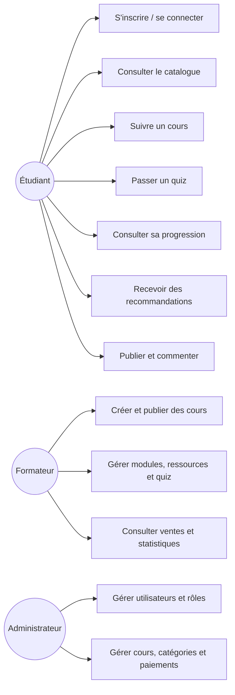
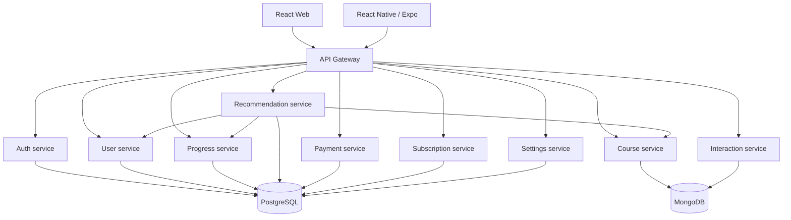
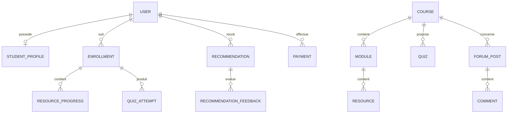
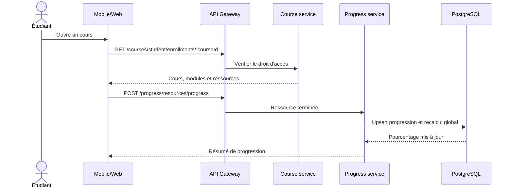
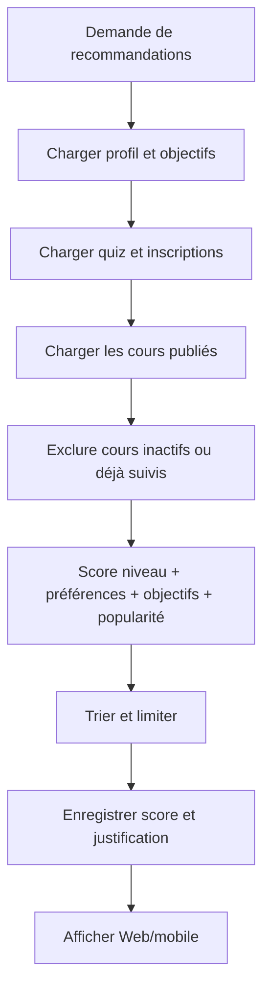
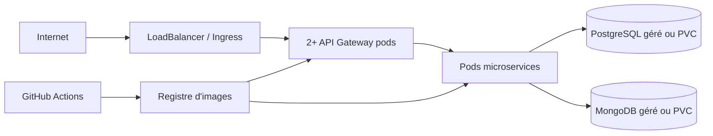

# Architecture et modélisation EduSmart

## Cas d’utilisation

## Architecture des services

## Modèle de données principal

`USER`, les inscriptions de progression, paiements et recommandations sont
stockés dans PostgreSQL. `COURSE`, ses documents imbriqués et les interactions
sont stockés dans MongoDB. Les identifiants de cours sont conservés sous forme
de chaîne dans PostgreSQL pour relier les deux technologies.

## Séquence : terminer une ressource

## Activité : recommandations

## Déploiement

